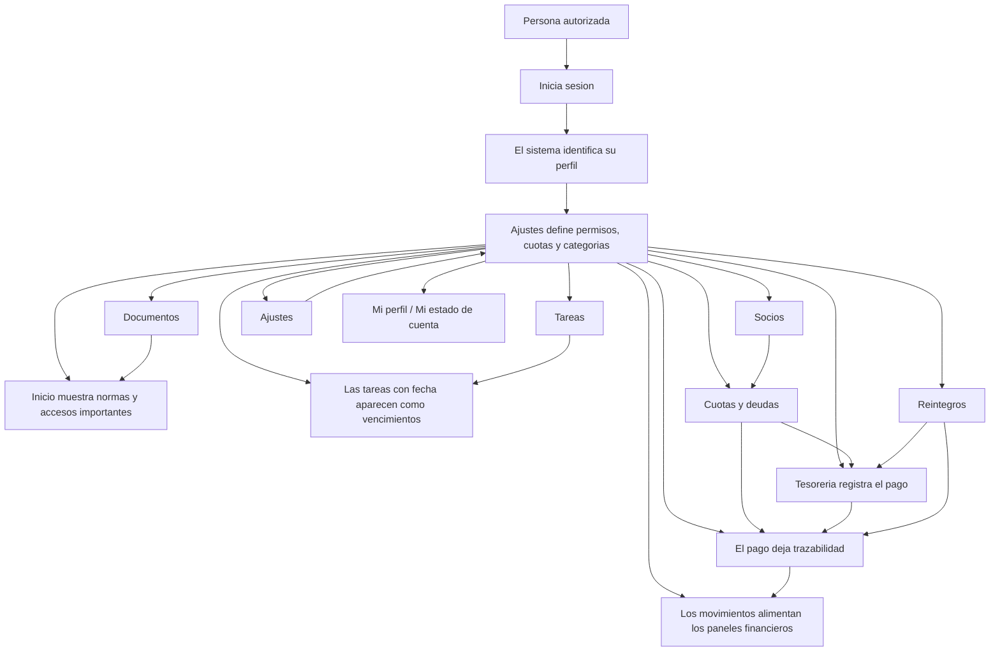

# Vision general del sistema interno AILE

## 1. Que es este sistema

El sistema interno AILE es el espacio de trabajo digital de la institucion.

No esta pensado para una sola tarea. Reune, en un mismo lugar, la informacion y las acciones mas importantes de la vida interna de AILE:

- personas y roles,
- cuotas y deudas,
- ingresos y egresos,
- cuentas y caja,
- reintegros,
- tareas,
- calendario,
- y documentos institucionales.

Su objetivo principal es ordenar la gestion diaria, dejar registro de lo que se hace y evitar que la informacion quede repartida en mensajes, planillas o conversaciones sueltas.

## 2. Para que existe

El sistema existe para resolver cinco necesidades centrales de AILE:

1. Tener una sola fuente de informacion confiable.
2. Saber que debe hacer cada persona y cuando.
3. Registrar cobros, pagos y movimientos con trazabilidad.
4. Ordenar la documentacion institucional.
5. Dar a cada persona solo el acceso que necesita para cumplir su rol.

## 3. Quienes usan el sistema

Hoy el sistema contempla dos niveles de definicion para cada persona:

### A. Rol general del sistema

Es el nivel de acceso general.

Los roles detectados actualmente son:

- `Socio`
- `Comision Directiva`
- `Revisor de Cuentas`
- `Administrador`

### B. Cargo o rol institucional dentro de AILE

Es la funcion concreta que esa persona cumple dentro de la institucion.

Ejemplos detectados en el sistema:

- Presidente
- Vicepresidente
- Secretario General
- Director de Finanzas
- Tesorero
- Revisor de Cuentas
- Vocal Titular
- Vocal Suplente
- Socio

En la practica, esto significa que dos personas pueden tener distinto acceso aunque ambas pertenezcan a AILE.

## 4. Idea simple de funcionamiento

El sistema funciona como una oficina digital organizada por modulos.

La persona:

1. entra con su cuenta,
2. el sistema reconoce quien es,
3. le muestra solo los modulos que le corresponden,
4. y desde ahi puede consultar, cargar, aprobar o seguir informacion segun su rol.

## 5. Diagrama general del funcionamiento

## 6. Como se navega

La navegacion principal del sistema se hace desde el menu lateral.

Los modulos detectados hoy son:

- Inicio
- Calendario
- Tareas
- Socios
- Deudas
- Movimientos
- Finanzas
- Tesoreria
- Reintegros
- Documentos
- Ajustes

Ademas, desde el menu del usuario se puede entrar a:

- Mi perfil
- Mi estado de cuenta
- Cerrar sesion

En celular, el sistema usa una barra inferior y un boton de "Mas" para mostrar el resto de las opciones.

## 7. Que ve una persona al entrar

La primera pantalla es `Inicio`.

Desde ahi, el sistema resume lo mas importante del momento. Segun el permiso de cada persona, puede mostrar:

- cantidad de socios activos,
- socios con deuda,
- saldo actual,
- resoluciones vigentes,
- fechas importantes del calendario,
- y accesos rapidos a modulos usados con frecuencia.

En otras palabras: `Inicio` funciona como tablero de situacion.

## 8. Relaciones mas importantes entre modulos

Para explicar el sistema de forma simple, estas son las relaciones clave:

### Socios y Deudas

La base de personas alimenta la gestion de cuotas y deudas.

### Deudas, Tesoreria, Movimientos y Finanzas

Cuando se registra un cobro de cuotas, ese cobro no queda aislado: impacta en la cuenta usada, queda como movimiento y luego aparece en los paneles financieros.

### Tareas y Calendario

Las tareas con fecha limite aparecen tambien como vencimientos en el calendario.

### Reintegros y Tesoreria

Los reintegros siguen un circuito de solicitud, revision, aprobacion y pago. Cuando el pago se registra, queda trazabilidad.

### Documentos e Inicio

Los documentos institucionales sirven como referencia formal y parte de esa informacion se resume tambien en la pantalla de inicio.

### Ajustes y todo el sistema

El modulo de ajustes define reglas que afectan a otros modulos, por ejemplo:

- roles y permisos,
- configuracion de cuotas,
- categorias financieras,
- y registros de actividad.

## 9. Forma simple de explicar los roles

Para una guia dirigida a personas no tecnicas, conviene decirlo asi:

- El `rol general` define hasta donde puede entrar una persona.
- El `cargo institucional` define para que parte de la organizacion trabaja esa persona.
- Los `permisos` terminan de ajustar que puede ver y que puede hacer.

## 10. Mensaje clave para la documentacion final

La idea central del sistema es esta:

> Cada persona entra a un unico lugar de trabajo, ve solo lo que necesita y deja registro claro de lo que consulta, carga, aprueba o paga.

Ese concepto deberia repetirse al inicio de la guia final en PDF y tambien dentro del sistema.
